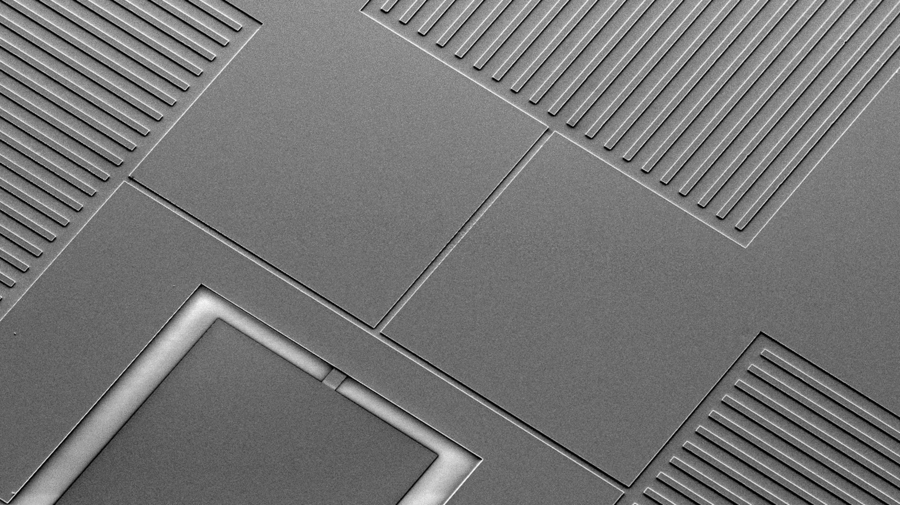

## Get things working

Here is the links to get ready with measurements and simulations at QDU lab

* [Install QCoDeS](https://microsoft.github.io/Qcodes/)
* [Get useful visualization software](https://github.com/toolsforexperiments/plottr)
* [Explore quantum electrons simulator](https://github.com/mbelianchikov/quantum_electron_rydberg)

Visit [QDU website](https://www.oist.jp/research/research-units/qdu) to learn more!

----
